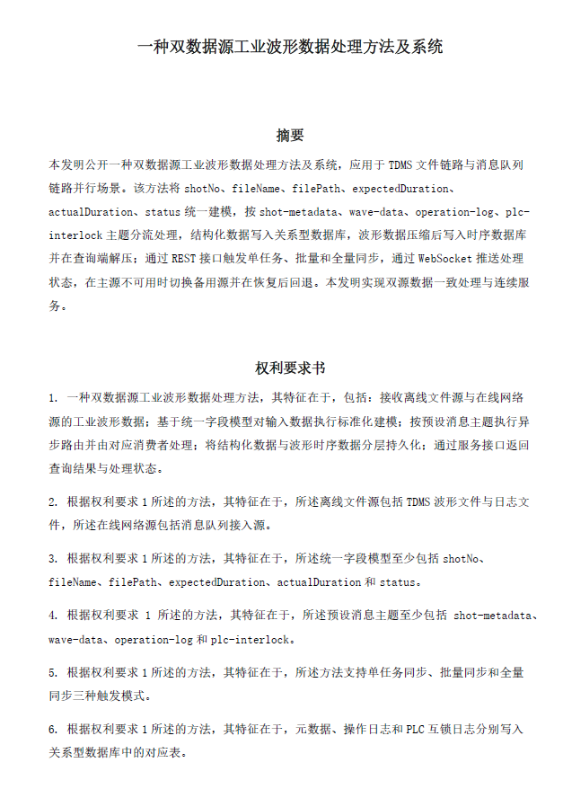

# repo2patent

一个将软件代码仓库自动转换为中国发明专利申请文档的 **Codex Skill**。基于代码库事实和本地专利语料，生成标准的专利申请文档（摘要、权利要求书、说明书、附图说明及 DOCX 格式文档）。

## 🎯 核心功能

- **代码事实提取**：自动分析仓库的模块结构、接口设计、数据流和技术方案
- **语料驱动写作**：学习本地专利语料风格，遵守国家知识产权局（CNIPA）官方规范
- **多轮审查修订**：4 轮迭代写作（技术交底 → 权利要求 → 说明书 → 审查修订）
- **质量校验**：验证术语一致性、清楚性、支持性、低信息密度检测
- **附图生成**：优先使用 Graphviz 自动布局，回退 PIL 手动渲染
- **DOCX 输出**：生成可提交的 DOCX 格式专利申请文档，保证渲染一致性

## 📋 技术特点

### ⚠️ 官方规范优先（强制）
- 依据《专利法》第 26 条、第 59 条和《专利审查指南》
- 严格遵守清楚性、简要性、完整性和支持性要求
- **本地语料风格与官方规范冲突时，一律以官方规范为准**

### 语料驱动写作（=非硬编码）
- 不使用固定模板拼接，基于真实语料学习写作风格
- 禁止将"代码解析流程"写入专利，专利对象是仓库实现的技术方案
- 脚本（代码事实提取、法规检索、格式校验、DOCX渲染）与写作阶段完全解耦
- 润色必须受源码事实约束：允许扩写处理条件/执行路径/输出结果/异常分支，禁止引入无依据参数

### 术语与一致性
- 摘要、权利要求、说明书三文一致
- **发明名称**必须完整一致地出现在标题、摘要首句、权利要求主题名称，不得截断或简写
- 全文术语统一，可逐项对应

### 质量控制
- 自动检测模糊表述、不可验证用语、术语不一致
- 低信息密度检测：对"仅有结论、缺少条件/动作/结果"的短句进行适度润色
- 渲染一致性检验：Markdown 与 DOCX 标题完整一致（如"及系统"不会丢失）
- 每轮实质改稿后必须重新执行格式校验与 DOCX 渲染

## 🚀 快速开始

### 环境要求

- Python 3.8+
- 可选：Graphviz（用于生成高质量附图）
- 可选：Git（用于克隆远程仓库）

### 安装依赖

```bash
# 检查环境
.\scripts\00_check_env.ps1  # Windows
# 或
bash scripts/00_check_env.sh  # Linux/macOS
```

Python 依赖包已包含在 `.vendor/` 目录中，无需额外安装。

### 使用说明

关于如何调用该 `SKILL`：请参阅 Codex 官方的 Skill 使用说明与本仓库的 `SKILL.md`，推荐通过 Codex/Agent 平台的标准流程来触发本技能的写作和校验步骤。

## 📂 项目结构

```
repo2patent/
├── agents/              # LLM 代理配置
├── analysis/            # 分析结果和中间文件
│   ├── context.json              # 代码事实提取结果
│   ├── legal_rules_lookup.md     # 法规检索结果
│   ├── validation_report.md      # 质量校验报告
│   └── llm_rounds/               # 各轮写作中间稿
├── assets/              # 资源文件
│   └── STOPWORDS_ambiguous.txt   # 模糊词库
├── draft/               # 生成的专利草稿（.gitignore）
│   ├── patent_draft.md           # Markdown 格式草稿
│   └── figures/                  # 附图源文件
├── out/                 # 最终输出（.gitignore）
│   └── patent_draft_*.docx       # DOCX 格式成品
├── output/              # 备用输出目录（.gitignore）
├── references/          # 参考文件和语料
│   ├── cn111177271a-style-notes.md
│   ├── cnipa-patent-writing-2017-notes.md
│   ├── local-patent-style-skill.md
│   ├── official_rules_catalog.json
│   ├── patent-draft-template.md
│   └── patent-writing-rules.md
├── scripts/             # 工具脚本
│   ├── 00_check_env.*            # 环境检查
│   ├── 01_clone_repo.sh          # 仓库克隆
│   ├── 02_repo_inventory.py      # 代码事实提取
│   ├── 04_validate_draft.py      # 草稿校验
│   ├── 05_render_docx.py         # DOCX 渲染
│   ├── generate_figures.py       # 附图生成
│   └── query_official_rules.py   # 法规检索
├── work/                # 工作目录
│   └── repo/                     # 待分析的源码仓库
└── SKILL.md             # 完整的工作流程说明
```

## 🔧 核心脚本说明

### 代码事实提取（02_repo_inventory.py）
自动分析仓库，提取：
- 模块结构和类关系
- 方法和接口定义
- 消息主题和数据流
- 技术特征和处理逻辑
- 结果保存到 `analysis/context.json`

### 法规检索（query_official_rules.py）
快速查询官方规范的关键要点：
- 生成 `analysis/legal_rules_lookup.md`
- 支持多轮查询（`--query` 参数）

### 草稿校验（04_validate_draft.py）
检查专利草稿的：
- 术语一致性（摘要、权利要求、说明书三文一致）
- 模糊表述检测（"高效"、"强"、"较好"等不可验证表述）
- 低信息密度检测（仅有结论、缺少条件/动作/结果的短句）
- 发明名称一致性（标题、摘要、权利要求完整一致）
- 格式规范（章节结构、引用关系）
- 生成 `analysis/validation_report.md`

### 附图生成（generate_figures.py）
- 优先使用 Graphviz 自动布局生成 SVG + PNG
- 无 Graphviz 时回退到 PIL 手动渲染
- 确保附图清晰、标号完整、无重叠
- 生成到 `draft/figures/`

### DOCX 渲染（05_render_docx.py）
- 将 Markdown 草稿转换为标准 DOCX 格式
- 保持标题完整性（如"及系统"不会丢失）
- 附图单独占页并居中排版
- 输出到 `out/patent_draft_<repo_slug>_YYYYMMDD[_HHMMSS].docx`

## 🎓 工作流程

完整的语料驱动专利撰写流程（**严格顺序**）：

1. **环境与仓库**
   - 运行 `scripts/00_check_env.ps1`（Windows）或 `scripts/00_check_env.sh`（Linux/macOS）
   - 优先复用本地仓库；仅在远程仓库场景调用 `scripts/01_clone_repo.sh`

2. **事实提取**
   - 运行 `scripts/02_repo_inventory.py --repo work/repo`
   - 抽取模块、方法、接口、消息主题、数据流，保存到 `analysis/context.json`

3. **法规检索**
   - 运行 `scripts/query_official_rules.py` 生成当前规则清单
   - **先完成"官方规范核对清单"，再进入写作阶段**

4. **语料学习**（必须）
   - 读取 `references/local-patent-style-skill.md`
   - 扫描目录内专利文本，归纳结构和句式

5. **语料驱动自由写作**（非硬编码）
   - **不调用正文生成脚本**，由助手基于语料与源码直接生成
   - **Round 1**: 技术交底（问题-方案-效果-证据映射）
   - **Round 2**: 权利要求书（独立项完整 + 从属项递进，无重复）
   - **Round 3**: 说明书（五段结构：技术领域/背景/发明内容/附图说明/具体实施方式）
     - 重点详写"发明内容+具体实施方式"
     - 包含输入、处理、输出、异常路径
   - **Round 4**: 审查修订（清楚性、支持性、单一性、术语一致性 + 低信息密度润色）

6. **校验与渲染**
   - 运行 `scripts/04_validate_draft.py` 检查质量
   - 修正校验命中的模糊风险词（"高效"、"强"、"较好"等不可验证表述）
   - 运行 `scripts/generate_figures.py` 生成附图（Graphviz 优先 → PIL 回退）
   - 运行 `scripts/05_render_docx.py` 输出成品
   - 回读 `draft/patent_draft.md` 与输出 DOCX，确认标题和章节渲染完整

## 示例输出

以下是生成的专利初稿示例（摘要与权利要求书）：



*图示：基于波形数据处理系统生成的专利草稿，包含完整的摘要和6项权利要求。*

## 📝 质量要求

### 摘要（Abstract）
- **结构**: 对象 + 场景 + 关键步骤 + 技术效果
- **长度**: 不超过 300 字
- **禁止**: 写工具流程、解析流程
- **一致性**: 首句主题名称必须与标题、权利要求主题名称完全一致

### 权利要求（Claims）
- **独立项**: 完整（包含全部必要技术特征）
- **从属项**: 递进（逐步限定当前方案，不与其他项重复技术特征）
- **引用关系**: 清晰、无歧义
- **用语**: 禁止宣传性用语，必须是可验证的技术特征
- **发明名称**: 必须完整、一致地出现在主题名称中

### 说明书（Specification）
- **五段结构**: 技术领域、背景技术、发明内容、附图说明、具体实施方式（必须完整）
- **重点详实**: 技术问题、发明内容、具体实施方式、技术效果 — 必须详写，不得以口号式短句替代
- **高密度写法**: 
  - 技术事实 + 处理逻辑 + 效果因果
  - 减少机械重复"进一步地"
  - 对"仅有结论、缺少条件/动作/结果任一要素"的短句进行适度润色
- **可实施程度**: 具体实施方式应包含输入、处理、输出、异常分支
- **术语一致**: 全文术语与权利要求一致

### 低信息密度检测与润色
- **识别**: 句子仅有结论、缺少条件/动作/结果任一要素
- **润色原则**:
  - 允许扩写处理条件、执行路径、输出结果、异常分支
  - 禁止引入无源码依据的参数和功能
  - 关键句优先包含"条件+处理+结果"中的至少两项

### 附图（Figures）
- **质量**: 分辨率足够、标号完整、无重叠、无空白图
- **类型**: 系统架构图、流程图、模块关系图
- **生成工具**: 优先 Graphviz（自动布局）→ 回退 PIL（手动渲染）
- **DOCX 排版**: 每张附图单独占一页并居中，图题置于图下方

### 渲染一致性
- **Markdown ↔ DOCX**: 标题完整且一致（如"及系统"不会丢失）
- **附图验证**: 回读输出 DOCX，确认所有附图清晰可见、页面视觉平衡

## 🚫 禁止事项（强制）

- **禁止**把"解析代码生成专利"写入专利文本
- **禁止**使用固定段落库拼接正文 — 必须基于语料学习后自由写作
- **禁止**调用 `scripts/03_generate_draft.py` 或 `scripts/03_generate_draft_llm.py`（已废弃）
- **禁止**在生成阶段直接套用模板 — 优先考虑官方规范与本地语料的冲突
- **禁止**出现"仅措辞变化但技术特征相同"的重复权利要求
- **禁止**用宣传性用语替代技术效果论证
- **禁止**润色时引入无源码依据的参数和新功能
- **禁止**跳过任何模块的质量校验和 DOCX 渲染验证

## 📚 参考资料

本工具遵循以下规范：
- 《中华人民共和国专利法》
- 《专利审查指南》
- 《如何撰写专利申请文件》（2017-07-20）
- CNIPA 专利撰写规范（2017）

## 📄 许可证

本项目仅供学习和研究使用。生成的专利草稿需经专业代理人审核后方可提交。

## 🤝 贡献

欢迎提交 Issue 和 Pull Request。

## ⚠️ 免责声明

- 本工具生成的专利草稿仅供参考，不构成法律意见
- 实际提交前必须经过专业专利代理人审核和修改
- 专利申请的法律责任由申请人自行承担

## 📮 联系方式

如有问题或建议，请在 GitHub 上提交 Issue。
